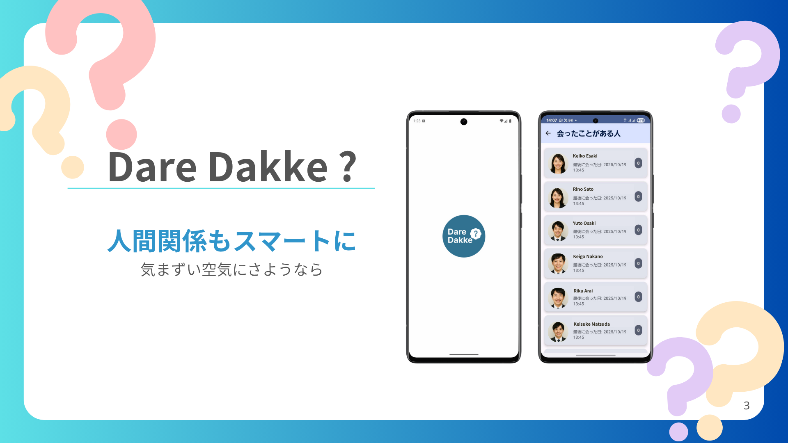
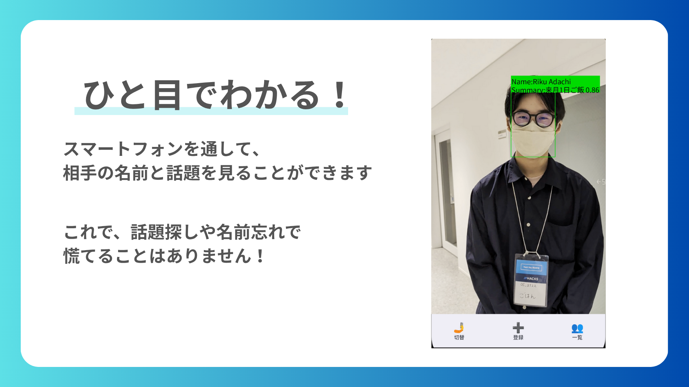

# DareDakke?

## 製品概要

### 背景（製品開発のきっかけ、課題等）

JPHACKSのような多くの人が一堂に会す場では、「この人、顔は覚えてるんだけど名前が…」だったり、「前話した内容忘れちゃった！聞き直すのも悪いしなあ…」という経験があると思います！
そんな悩みを解決するアプリを開発しました！

### 製品説明（具体的な製品の説明）

「DareDakke?」は、AR（拡張現実）技術とAIを活用して、”この人、誰だっけ？”という気まずい瞬間をなくし、人間関係をさらに円滑にするためのAndroidアプリケーションです！

カメラを気になる人物に向けるだけで、以前に会ったことがある人であれば、その人の名前や前回話した内容の要約が画面上にポップアップ表示されます。初対面の人であれば、その場で会話内容から名前や会話内容を登録します！
前回の会話内容の要約が表示されるので、さらに会話が弾んだりコミュニケーションがさらに円滑に！？

### 特長

#### 1. "この人の名前なんだっけ？"を防ぐ名前表示機能

カメラに人が検出され、その人が過去に会ったことがある人だった場合はその人の名前を表示！
突然話しかけられてもこれであんしんです！

#### 2. "この間会ったときの記憶がない！"をなくす会話の要約表示機能

会話中はマイクを使用して会話内容を文字起こし、それをLLMで処理して一文要約を表示します！
「お子さんの誕生日近かったですよね！」「来週のお食事楽しみにしています！」など会話がさらに広げやすく、気まずい雰囲気も流れません！
これでみなさんもできる大人です！

### 解決出来ること

-   **記憶の補助:** どうしても人の名前が覚えられない、思い出せない！そんな方を救います！
-   **コミュニケーションの円滑化:** 一度会った人の顔と名前、さらには過去の会話内容を記録・表示することで、「"気まずい"をなくし"デキる"を作ります」。

### 今後の展望

本来はARグラスなどを使用して、よりシームレスな体験を目指していましたが、今回は費用と時間の都合で断念しました。AwardDayに進出した際には、ARグラスでの実装に挑戦し、ハンズフリーでの人物認識を実現します！

### 注力したこと（こだわり等）

-   **オンデバイスでの高速な顔特徴量抽出:** ユーザーのプライバシーに配慮し、リアルタイム性を確保するため、顔検出（ML Kit）と特徴量抽出（TensorFlow Lite / MobileFaceNet）は全てAndroidデバイス上で完結させています。
-   **非同期処理によるUX向上:** 会話の音声データは、録音後にバックエンドへ非同期でアップロードされます。文字起こしと要約はバックグラウンドジョブとして実行されるため、ユーザーは処理を待つことなくアプリを使い続けられます。
-   **宣言的UIによる効率的な開発:** Android アプリの UI は全て Jetpack Compose で構築しました。これにより、状態管理が簡素化され、リアクティブでモダンな UI を効率的に実装できました。

## 開発技術

### 活用した技術

#### API・データ

-   **Gemini API:** 会話の要約、および会話の話題提案機能で使用。
-   **Google Cloud Speech-to-Text:** 会話音声の文字起こしで使用。

#### フレームワーク・ライブラリ・モジュール

-   **Android:**
    -   **Jetpack Compose:** 宣言的な UI ツールキット。
    -   **CameraX:** カメラ機能の実装を簡素化するライブラリ。
    -   **ML Kit Face Detection:** カメラ映像からの顔検出。
    -   **TensorFlow Lite (MobileFaceNet):** 検出した顔から特徴量ベクトルを生成。
    -   **Room:** ローカルデータベースによるデータ永続化。
    -   **Retrofit:** APIとの通信。

#### デバイス

-   Android

### 独自技術

#### ハッカソンで開発した独自機能・技術

-   **顔認識と会話履歴の統合システム:** オンデバイスでリアルタイムに顔の特徴量を抽出し、サーバーサイドで高速に人物を特定。その人物との過去の会話の一文要約を即座に呼び出すことで、「誰と何を話したか」をスムーズに思い出せるシステムを開発しました。
    -   **特に力を入れた部分:**
        -   スマートフォン上で軽量かつ高速に顔の特徴量を抽出する技術
            -   `daredakke/app/src/main/java/com/example/daredakke/ml/face/FaceRecognizer.kt`

-   **非同期の音声処理パイプライン:** Androidの `WorkManager` を活用し、録音された音声のアップロード、文字起こし、そしてGemini APIによる会話内容の要約までを、バックグラウンドで安定して実行する非同期処理パイプラインを実装しました。これにより、ユーザーはアプリを閉じても処理が継続される、スムーズなUXを実現しました。
    -   **特に力を入れた部分:**
        -   録音した音声から文字起こしを行い、AIで要約してアプリに表示するまでの一連の処理フロー
            -   `daredakke/app/src/main/java/com/example/daredakke/workers/TranscriptionWorker.kt`

#### PS

Goファイルは頑張った証です。使用していません。暖かく見守ってください。